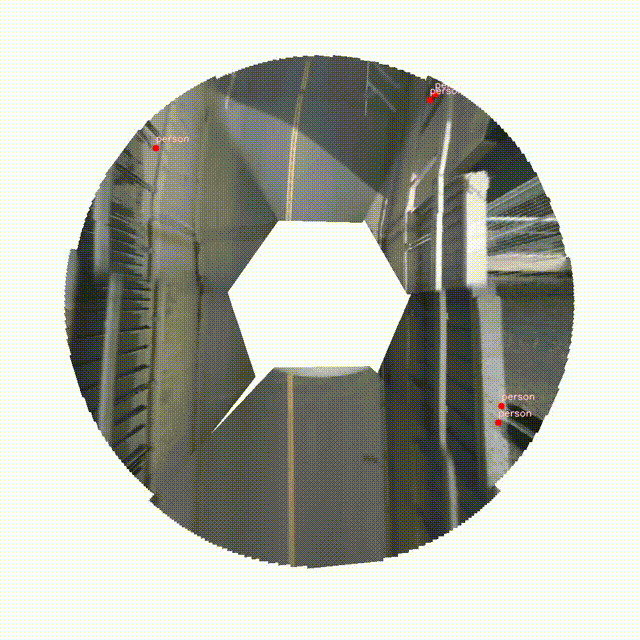

# Multi-Camera Bird's Eye View (BEV) Generator

A comprehensive toolkit for generating Bird's Eye View (BEV) visualizations from multi-camera systems using the NuScenes dataset. This project provides various methods for projecting camera images onto a ground plane, stitching them together, and overlaying object detection results and distance information.



## Features

- **Multi-Camera BEV Generation**: Transform images from multiple cameras into a unified top-down view.
- **Multiple Stitching Strategies**:
  - **Contour-based Stitching**: Advanced stitching based on contour distances for smooth transitions between camera views.
  - **Position-based Stitching**: Camera position-aware blending for realistic perspective.
- **Object Detection Integration**: YOLOv8 integration for detecting vehicles, pedestrians, and other traffic participants.
- **Customizable Resolution**: Adjust BEV resolution to balance detail and performance.
- **Brightness Balancing**: Post-processing option to harmonize brightness across the stitched image.
- **Video Generation**: Create MP4 videos from BEV frames with or without detection markers.
- **Distance Calculation**: Calculate distance to objects in the BEV video.

## Installation

1. Clone this repository:
```bash
git clone https://github.com/yourusername/Birds-Eye-View.git
cd Birds-Eye-View
```

2. Use Conda to create an environment:
```bash
conda env create -f bev_conda.yml
```

3. Download the [NuScenes dataset](https://www.nuscenes.org/download) (v1.0-mini) and extract it to the root directory.
   The directory structure should be as follows:
   ```
   Birds-Eye-View
   ├── v1.0-mini
   │   ├── maps
   │   ├── samples
   │   ├── sweeps
   │   └── v1.0-mini
   ```

## Usage
**The bev.ipynb file contains all the results of the project.**
[notebook](bev.ipynb)

### BEV Generation
run the following command to generate the BEV image:
```python
python bev_bp.py
```

### BEV Video Generation

Generate BEV videos with the command-line tool:

```bash
# Generate BEV video without detection markers
python generate_bev_video.py --output bev_video.mp4

# Generate BEV video with detection markers
python generate_bev_video.py --output bev_detection_video.mp4 --wd
```

```
--output       Path to save the output video (default: bev_video.mp4)
--frames       Number of frames to process (default: 120)
--start_frame  Index of the first frame to process (default: 40)
--fps          Frames per second in output video (default: 2)
--dataroot     NuScenes data root directory
--version      NuScenes version (default: v1.0-mini)
--fusion       Fusion strategy: contour_based or position_based (default: contour_based)
--wd           Include object detection markers in the video
```

## Project Structure

- **backward_projection.py**: Core functions for projecting camera images to BEV.
- **bev_bp.py**: Multi-camera BEV generation and stitching algorithms.
- **object_detection.py**: YOLOv8 integration for object detection and BEV projection.
- **generate_bev_video.py**: Video generation tool with optional detection visualization.
- **models/**: Directory containing YOLOv8 model weights.
- **bev.ipynb**: Jupyter notebook with examples and visualizations.

## Stitching Methods

### Contour-based Stitching
Uses distance to camera region contours to determine blending weights in overlap areas. This creates smooth transitions between cameras and handles occlusions well.

### Position-based Stitching
Utilizes camera position and prioritization to determine blending weights. Front cameras get higher priority than side cameras, with distance-to-edge also factored in.

## Object Detection

The project uses YOLOv8 to detect objects in camera images and project them onto the BEV:

- Supported classes: person, car, truck, bus, motorcycle, bicycle
- Detection points are visualized with color-coded markers

## Distance Calculation

The distance calculation is based on the camera position and the object's position in the BEV.

## Reference
[surround-view-system-introduction](https://github.com/hynpu/surround-view-system-introduction/blob/master/doc/en.md)

[nuScenes Dataset](https://github.com/nutonomy/nuscenes-devkit)